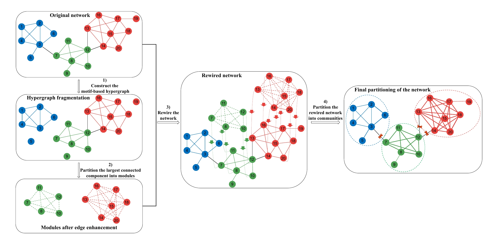

EdMot
[](https://paperswithcode.com/sota/community-detection-on-cora?p=edmot-an-edge-enhancement-approach-for-motif)


============================================
A NetworkX implementation of "EdMot: An Edge Enhancement Approach for Motif-aware Community Detection" (KDD 2019).
<p align="center">
  
</p>

### Abstract

<p align="justify">
Network community detection is a hot research topic in network analysis. Although many methods have been proposed for community detection, most of them only take into consideration the lower-order structure of the network at the level of individual nodes and edges. Thus, they fail to capture the higher-order characteristics at the level of small dense subgraph patterns, e.g., motifs. Recently, some higher-order methods have been developed but they typically focus on the motif-based hypergraph which is assumed to be a connected graph. However, such assumption cannot be ensured in some real-world networks. In particular, the hypergraph may become fragmented. That is, it may consist of a large number of connected components and isolated nodes, despite the fact that the original network is a connected graph. Therefore, the existing higher-order methods would suffer seriously from the above fragmentation issue, since in these approaches, nodes without connection in hypergraph can't be grouped together even if they belong to the same community. To address the above fragmentation issue, we propose an Edge enhancement approach for Motif-aware community detection (EdMot ). The main idea is as follows. Firstly, a motif-based hypergraph is constructed and the top K largest connected components in the hypergraph are partitioned into modules. Afterwards, the connectivity structure within each module is strengthened by constructing an edge set to derive a clique from each module. Based on the new edge set, the original connectivity structure of the input network is enhanced to generate a rewired network, whereby the motif-based higher-order structure is leveraged and the hypergraph fragmentation issue is well addressed. Finally, the rewired network is partitioned to obtain the higher-order community structure. Extensive experiments have been conducted on eight real-world datasets and the results show the effectiveness of the proposed method in improving the community detection performance of state-of-the-art methods.</p>

This repository provides a NetworkX implementation of EdMot as described in the papers:

> EdMot: An Edge Enhancement Approach for Motif-aware Community Detection
> Pei-Zhen Li, Ling Huang, Chang-Dong Wang, and  Jian-Huang Lai .
> KDD, 2019.
> [[Paper]](https://arxiv.org/abs/1906.04560)

A Matlab implementation of EdMot is available [[here]](https://github.com/lipzh5/EdMot_pro).

### Requirements
The codebase is implemented in Python 3.5.2. package versions used for development are just below.
```
networkx          1.11
tqdm              4.28.1
pandas            0.23.4
texttable         1.5.0
argparse          1.1.0
python-louvain    0.11
```
### Datasets

The code takes the **edge list** of the graph in a csv file. Every row indicates an edge between two nodes separated by a comma. The first row is a header. Nodes should be indexed starting with 0. A sample graph for `Cora` is included in the  `input/` directory.

### Options
Training a model is handled by the `src/main.py` script which provides the following command line arguments.

#### Input and output options
```
  --edge-path         STR    Edge list csv.       Default is `input/cora_edges.csv`.
  --membership-path   STR    Features json.       Default is `output/cora_membership.json`.
```
#### Model options
```             
  --cutoff       INT     Random seed.                   Default is 2.
  --components   INT     Number of motif components.    Default is 1.
```
### Examples
The following commands learn an EdMot Clustering.
```
python src/main.py
```
<p align="center">

</p>

Increasing the motif component number.
```
python src/main.py --components 2
```
